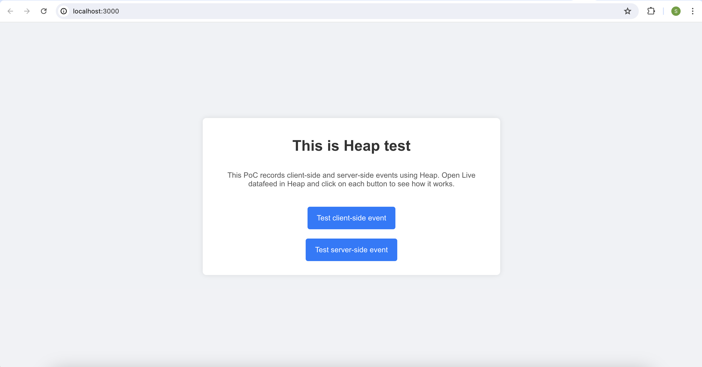
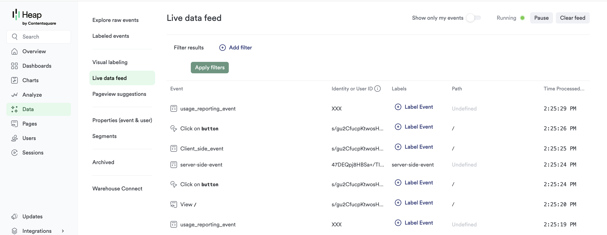

# Overview

This project demonstrates how to send server-side and client-side events with custom properties to Heap.io.
It consists of the frontend app (`src/App.js`) and the server (`src/heap-backend/server.js`).

When the frontend application (`src/App.js`) is initialized, it reads the .env file and adds the following properties to both the current user and all events:
- license_id;
- license_type;
- hubspot_contact_id;
- hubspot_company_id;
- cloud_org_id;
- app_version.

Then the frontend application renders two buttons to test server-side and client-side event:
- When a user clicks on the 'Test client-side event', the frontend emits the 'client_side_event` event using Heap JS SDK (heap.track).
- When a user clicks on the 'Test server-side event', the frontend emits an API call to the backend (`src/heap-backend/server.js`) which sends the 'server_side_event` using Heap REST APIs.

Additionally, the server app sends the `usage_reporting_event` every 10 seconds using Heap REST API.

Note, that the `server_side_event` and `client_side_event` event are recorded in the same session.
This is possible because the frontend apps sends session ID to the backend which then adds it to the `session_id` property in the request to Heap API:
```javascript
axios.post('https://heapanalytics.com/api/track', {
    app_id: config.heap_app_id,
    identity: userId,
    event: 'server-side-event',
    properties: properties,
    session_id: sessionId
})
```

The `session_id` is not mentioned in the official Heap documentation, but it must be included in the request body so that the `server_side_event` is in the same session as the frontend events.

# Launching the app

To launch the application you need to update the config:
1. Replace YOUR_HEAP_ID with your actual Heap app ID in `public/index.html` (line 9).
2. Copy `env_sample` to `.env`, replace YOUR_HEAP_ID with your actual Heap app ID.
3. Add execution rights to `./start.sh ` by executing `chmod +x ./start.sh`.

Once the above two steps are completed, launch the application with the following command:
```shell
./start.sh
```

# Testing the app

Once the app is app and running, open http://localhost:3000. You should see the following:


Then, once you've clicked on both buttons, in Live datafeed you see these events in the Live data feed in Heap.
Here is what you should see in Heap:
